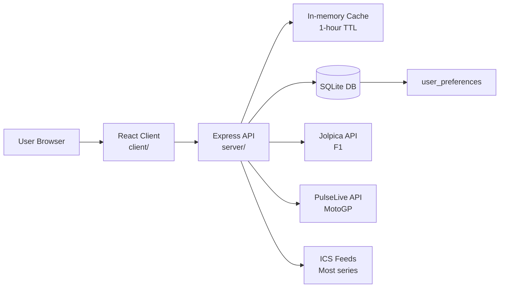
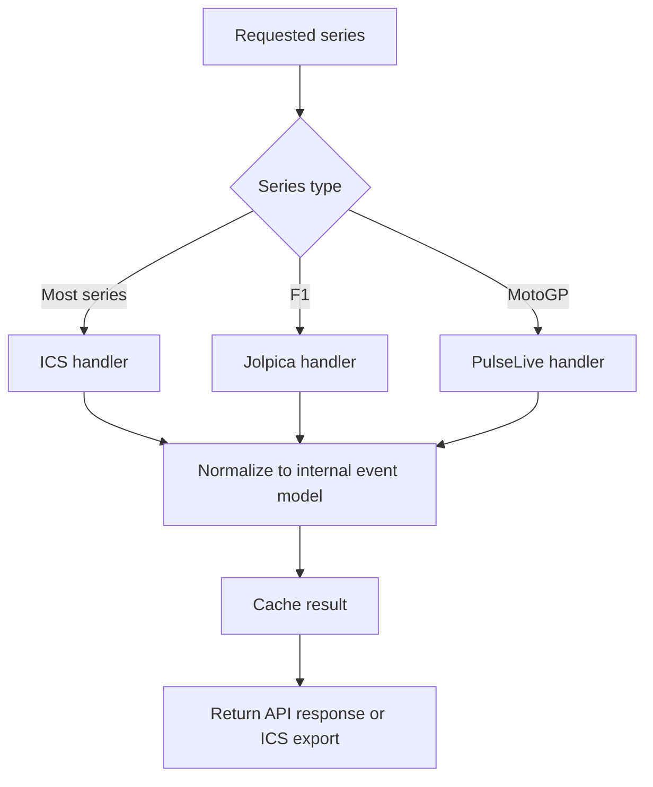
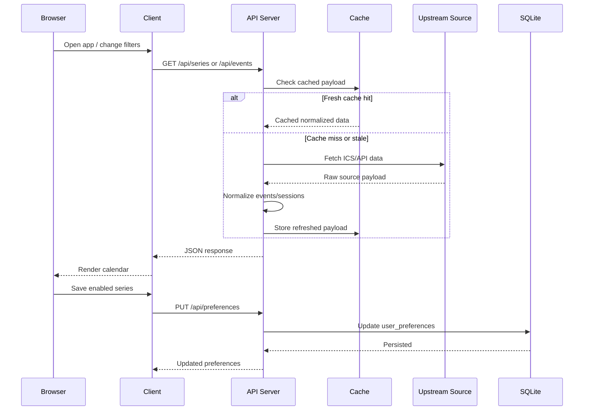
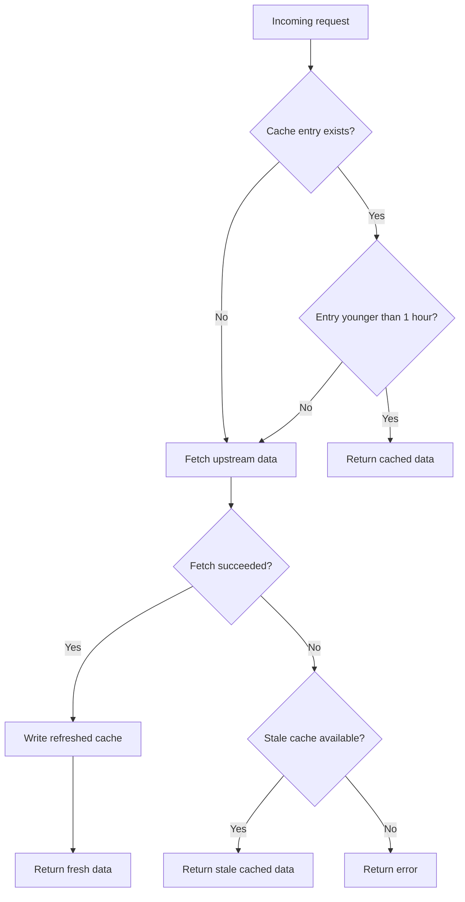

# GridStart Architecture

GridStart is a full-stack motorsport calendar application that aggregates race schedules from multiple upstream sources into a single normalized calendar experience. The repository is organized around a React frontend, an Express backend, shared contracts, configuration-driven series definitions, and a lightweight SQLite persistence layer for user preferences.

## System overview

At a high level, GridStart separates presentation, API orchestration, feed ingestion, caching, and persistence. The client requests series, events, preferences, and ICS exports from the backend, while the backend coordinates external feed handlers, applies caching and rate limits, and returns normalized data to the UI.

## Repository layout

The top-level repository includes `client/`, `server/`, `shared/`, and `script/`, plus configuration files such as `ics-feeds.json`, `drizzle.config.ts`, `.env.example`, and `package.json`. That layout suggests a deliberate split between UI concerns, backend orchestration, shared schemas/types, and operational helpers.

| Path | Purpose |
|---|---|
| `client/` | React frontend, UI state, routing, event display, filtering, and theme behavior. |
| `server/` | Express API endpoints, feed fetching, caching, normalization, export generation, and rate limiting. |
| `shared/` | Shared types, schemas, or contracts used across client and server boundaries. |
| `script/` | Utility scripts and maintenance helpers outside the main runtime path. |
| `ics-feeds.json` | Configuration-driven definition of motorsport series, handlers, colors, and feed parameters. |
| `drizzle.config.ts` | Drizzle ORM configuration for the SQLite-backed persistence layer. |

## Runtime components

The frontend is React 18 with TypeScript, Vite, Tailwind CSS, Radix UI, Wouter, TanStack Query, and date-fns. The backend is Express with TypeScript, SQLite, Drizzle ORM, Better SQLite3, and ICAL.js, which makes the system a compact full-stack TypeScript application with minimal infrastructure requirements.

### Client

The client is responsible for rendering the calendar experience, loading available series, fetching events for date ranges, storing preference choices through the backend, and initiating ICS exports. With responsive design, theme switching, and series filtering, the frontend should be understood as both the interaction layer and the primary composition point for normalized event data.

### Server

The server acts as the integration hub. It exposes API endpoints, fetches source data from ICS feeds and special APIs, applies cache lookups and refreshes, enforces endpoint-specific rate limits, and emits normalized responses to the client and ICS consumers.

### Shared layer

The `shared/` directory is a strong indicator that core contracts are reused across the stack. In practice, this includes database schema definitions, TypeScript models, validation contracts, and shared constants that help keep the client and server aligned as features evolve.

### Persistence

SQLite stores a `user_preferences` table containing enabled series as JSON. GridStart persists user configuration but treats external schedule sources as the system of record for event data rather than maintaining a large local event warehouse.

## Data sources and handlers

GridStart uses multiple upstream source strategies rather than a single provider. Most series are configured as ICS-based feeds, while Formula 1 and MotoGP use dedicated upstream APIs for richer session-level timing data.

### Configuration-driven expansion

Many series can be added through `ics-feeds.json` instead of custom application code. The following configuration fields are available: `id`, `name`, `shortName`, `color`, `handler`, `params`, `enabled`, and optional `sessionNames`, which means new calendar sources can often be onboarded by extending configuration plus handler support rather than redesigning the system.

## Request and data flow

The main operational path starts with client requests to the backend. The backend then resolves the requested series, checks cache state, fetches fresh data when needed, normalizes source-specific fields into a common shape, and returns data to the client or transforms it into an ICS download.

## API surface

The API includes `GET /api/series`, `GET /api/events`, `GET /api/preferences`, `PUT /api/preferences`, and `GET /api/export.ics`. Backend is oriented around discovery, event retrieval, preference persistence, and export generation rather than broad CRUD operations.

| Endpoint | Responsibility |
|---|---|
| `GET /api/series` | Returns available series metadata for filtering and display. |
| `GET /api/events` | Returns normalized events for selected series and a date range. |
| `GET /api/preferences` | Loads saved series preferences. |
| `PUT /api/preferences` | Persists updated enabled-series preferences. |
| `GET /api/export.ics` | Produces an exportable ICS calendar for selected series. |

## Caching and resilience

There is a 1-hour cache TTL for all external data sources, with keys based on series ID or year depending on the feed type. When data is fresh, cached values are returned immediately; when data is stale, the backend refreshes it, and if a refresh fails, stale data can still be used as a fallback.

This design reduces latency and upstream dependency pressure without introducing extra infrastructure. Current constraints: cache is in-memory only, is scoped to a single server instance, does not survive restarts, and has no manual invalidation path yet.

