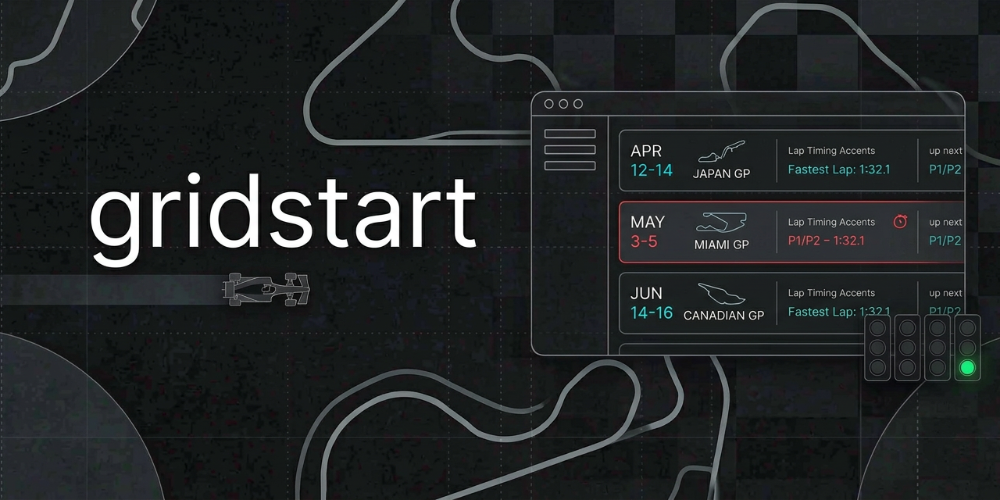
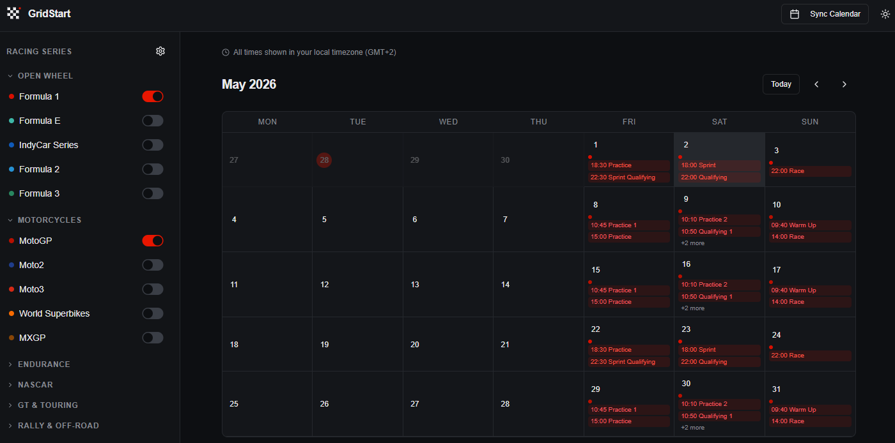

# GridStart

[](./LICENSE.txt)


[](https://github.com/mblancolabs/gridstart/stargazers)

A modern motorsport calendar application that aggregates racing schedules from multiple series into a unified calendar view. Built with React, TypeScript, and Express.

GridStart is available in two editions:

- **Free Edition** (current) — No database required. User preferences are stored in a browser cookie. Fully self-contained.
- **Premium Edition** (planned) — Adds persistent storage with SQLite, user accounts, and per-user preferences.



## Features

- **Multi-Series Support**: Tracks events from Formula 1, MotoGP, WEC, NASCAR, and many other motorsport series
- **Real-Time Data**: Fetches live session times from official APIs (F1 via Jolpica, MotoGP via PulseLive)
- **Calendar Export**: Export your selected events as ICS files for integration with Google Calendar, Outlook, etc.
- **Responsive Design**: Works seamlessly on desktop and mobile devices
- **Dark/Light Theme**: Toggle between themes for comfortable viewing
- **Series Filtering**: Enable/disable series based on your interests
- **Session-Level Detail**: View practice, qualifying, sprint, and race sessions with exact timing



## Supported Series

### Open Wheel

- Formula 1 (F1) - Live session data from Jolpica API
- Formula E (FE)
- IndyCar Series
- Formula 2 (F2)
- Formula 3 (F3)

### Motorcycles

- MotoGP - Live session data from PulseLive API
- World Superbikes (WSBK)
- MXGP

### Endurance

- WEC / Le Mans
- IMSA SportsCar
- European Le Mans Series (ELMS)

### NASCAR

- NASCAR Cup Series
- NASCAR Xfinity

### GT & Touring

- DTM
- GT World Challenge Europe
- Supercars Championship
- British Touring Car Championship (BTCC)
- Intercontinental GT Challenge

### Rally & Off-Road

- World Rally Championship (WRC)
- Dakar Rally

## Data Refresh Timing

The application uses **1-hour caching** for all external data feeds:

### Cache Duration

- **TTL (Time To Live)**: 1 hour (60 minutes)
- **Cache Key**: Based on series ID and year (for API feeds)

### Refresh Behavior

**Fresh Data (within 1 hour):**

- Returns cached data immediately without making API calls
- Fastest response time

**Stale Data (after 1 hour):**

- Makes fresh API/ICS requests to update cache
- If the fresh request fails, falls back to stale cached data
- Ensures the app continues working even if external services are down

### Feed Types & Refresh Patterns

1. **ICS Feeds** (most series):
   - Cached per series ID
   - Refreshes every hour when accessed

2. **F1 (Jolpica API)**:
   - Cached per year (`f1-{year}`)
   - Refreshes every hour when F1 events are requested

3. **MotoGP (PulseLive API)**:
   - Cached per year (`motogp-{year}`)
   - Refreshes every hour when MotoGP events are requested

### Cache Storage

- **MemoryCache** (default): In-memory storage, lost on restart — no dependencies
- **RedisCache** (optional): Persistent cache via Redis/Upstash — survives restarts and cold starts
- Configurable via `REDIS_URL` + `REDIS_TOKEN` env vars. Falls back to MemoryCache when unset.

### Manual Refresh

Currently, there's no manual cache invalidation - data refreshes automatically based on the 1-hour TTL. If you need immediate updates, you would need to restart the server or wait for the cache to expire naturally.

## Tech Stack

### Frontend

- **React 19** with TypeScript
- **Vite** for build tooling
- **Tailwind CSS v4** for styling
- **Radix UI** components
- **Wouter** for routing
- **TanStack Query** for data fetching
- **date-fns** for date handling

### Backend

- **Express.js** with TypeScript
- **ICAL.js** for calendar parsing/export

## Prerequisites

- Node.js 18+
- npm or yarn

## Environment Variables

The application supports the following environment variables:

- `PORT`: Server port (default: 5000)
- `NODE_ENV`: Environment mode (`development` or `production`)
- `CORS_ORIGIN`: CORS origin for development (default: `http://localhost:5173`)
- `DEV_CSP_WS_ORIGIN`: WebSocket origin for development CSP (defaults to `CORS_ORIGIN` converted to `ws:`)
- `CSRF_SECRET`: Secret key for stateless double-submit cookie CSRF protection
- `RATE_LIMIT_WINDOW_MS`: General API rate limit window in milliseconds (default: 900000 / 15 minutes)
- `RATE_LIMIT_MAX`: General API max requests per IP per window (default: 100)
- `EXPORT_RATE_LIMIT_WINDOW_MS`: Export endpoint rate limit window in milliseconds (default: 3600000 / 1 hour)
- `EXPORT_RATE_LIMIT_MAX`: Export endpoint max requests per IP per window (default: 10)
- `PREFERENCES_RATE_LIMIT_WINDOW_MS`: Preferences update rate limit window in milliseconds (default: 300000 / 5 minutes)
- `PREFERENCES_RATE_LIMIT_MAX`: Preferences update max requests per IP per window (default: 20)
- `STATIC_RATE_LIMIT_WINDOW_MS`: Static files rate limit window in milliseconds (default: 900000 / 15 minutes)
- `STATIC_RATE_LIMIT_MAX`: Static files max requests per IP per window (default: 1000)
- `REDIS_URL`: Redis/Upstash REST URL. Leave unset for in-memory cache (default).
- `REDIS_TOKEN`: Redis/Upstash REST token. Required if `REDIS_URL` is set.
- `KV_REST_API_URL`: Vercel KV REST URL (alternative to `REDIS_URL`, auto-injected by Vercel).
- `KV_REST_API_TOKEN`: Vercel KV REST token (alternative to `REDIS_TOKEN`, auto-injected by Vercel).
- `CACHE_TTL`: Cache TTL in seconds (default: 3600 / 1 hour).

Create a `.env` file in the root directory to override these defaults. See `.env.example` for reference.

### Vercel Deployment

GridStart supports deployment on Vercel. See [`backlog/vercel.md`](backlog/vercel.md) for the implementation plan.

## Installation

1. Clone the repository:

   ```bash
   git clone <repository-url>
   cd gridstart
   ```

2. Install dependencies:
   ```bash
   npm install
   ```

## Development

Start the development server:

```bash
npm run dev
```

The application will be available at `http://localhost:5000` (or the port specified in your `PORT` environment variable).

## Production Build

1. Build the application:

   ```bash
   npm run build
   ```

2. Start the production server:
   ```bash
   npm start
   ```

## API Endpoints

- `GET /api/series` - List all available series
- `GET /api/events?series=f1,motogp&from=2026-01-01&to=2026-12-31` - Fetch events for specified series and date range
- `GET /api/export.ics?series=f1,motogp` - Export calendar as ICS file

### Rate limiting

The backend applies rate limiting to protect the API and preserve service availability:

- `GET /api/series`, `GET /api/events`: 100 requests per IP every 15 minutes
- `GET /api/export.ics`: 10 requests per IP every 1 hour

Rate-limited requests return HTTP `429 Too Many Requests` with a JSON payload and `Retry-After` header.

## Configuration

### ICS Feeds

Series data is configured using one or more feed definition files.

By default, GridStart loads the main feed configuration and can support additional feed files for custom or private overrides. This makes it possible to extend or override upstream feed definitions without modifying the default configuration directly.

The primary feed configuration file is `calendar-feeds.json`. Each series includes:

- `id`: Unique identifier
- `name`: Full series name
- `shortName`: Display abbreviation
- `color`: Hex color for UI theming
- `handler`: Feed handler name
- `params`: Handler-specific parameters, such as `url` for ICS feeds or `class` for MotoGP
- `enabled`: Default enabled state
- `sessionNames`: Optional array of standard session names to expose for that series

When multiple feed files are present, custom definitions and overrides can be layered on top of the default set.

Standard session names include: `Practice`, `Practice 1`, `Practice 2`, `Practice 3`, `Qualifying`, `Sprint Qualifying`, `Sprint`, `Warm Up`, `Race`, and `Test`.

### Special Series

- **F1**: Uses Jolpica API for detailed session timing instead of ICS feeds
- **MotoGP**: Uses PulseLive API for session-level data

## Preferences Storage

User preferences (which series are enabled) are stored in a browser cookie (`gridstart_enabled_series`) with a one-year expiry. No server-side database is required.

## License

MIT License - see LICENSE file for details.
