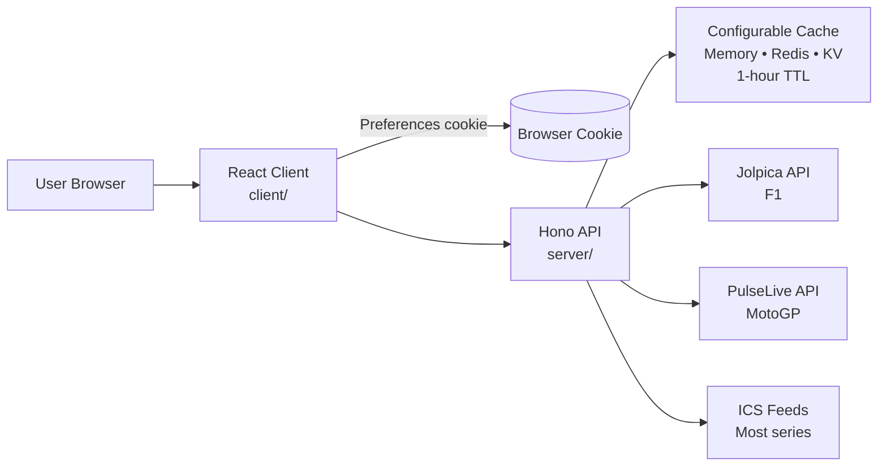
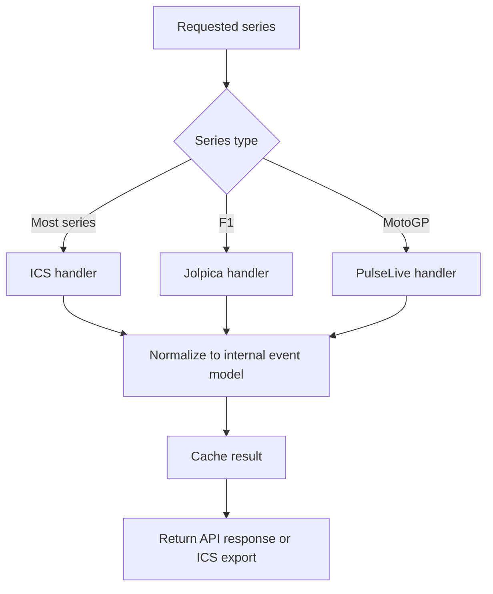
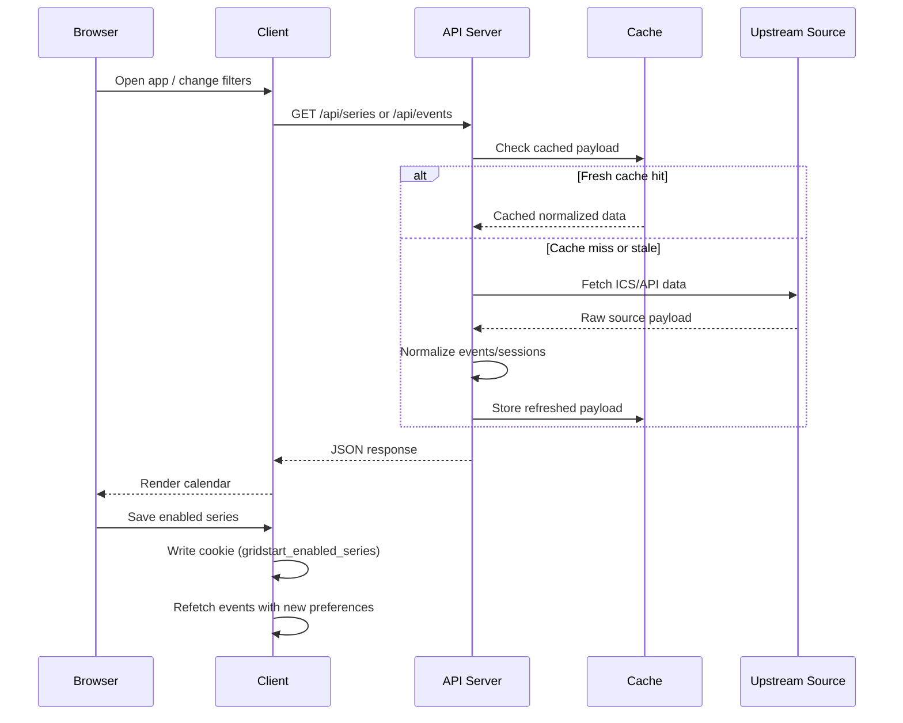
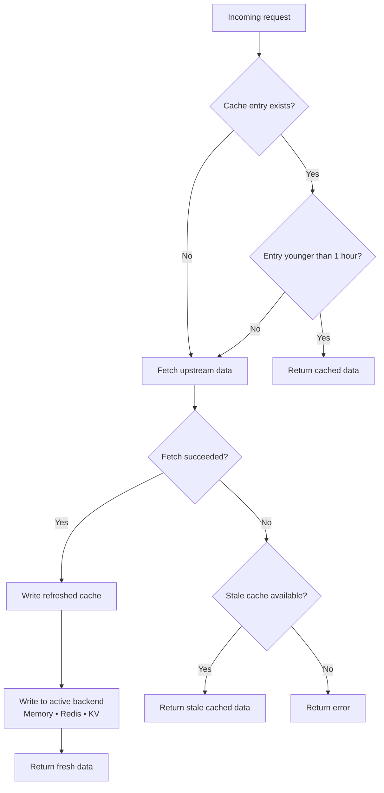

# GridStart Architecture

GridStart is a full-stack motorsport calendar application that aggregates race schedules from multiple upstream sources into a single normalized calendar experience. The repository is organized around a React frontend, a Hono backend (deployable to Cloudflare Workers or a VPS), shared contracts, and configuration-driven series definitions. User preferences are stored client-side in a browser cookie.

## System overview

At a high level, GridStart separates presentation, API orchestration, feed ingestion, caching, and persistence. The client requests series, events, preferences, and ICS exports from the backend, while the backend coordinates external feed handlers, applies caching and rate limits, and returns normalized data to the UI.



## Repository layout

The top-level repository includes `client/`, `server/`, `shared/`, and `script/`, plus configuration files such as `config/calendar-feeds.json`, `.env.example`, and `package.json`. That layout suggests a deliberate split between UI concerns, backend orchestration, shared schemas/types, and operational helpers.

| Path                         | Purpose                                                                                             |
| ---------------------------- | --------------------------------------------------------------------------------------------------- |
| `client/`                    | React frontend, UI state, routing, event display, filtering, and theme behavior.                    |
| `server/`                    | Hono API endpoints, feed fetching, caching, normalization, export generation, and rate limiting. Core app definition (`app.ts`) shared across entry points. Dual deployment: Worker entry (`worker.ts`) and VPS entry (`production.ts`). Dev entry (`index.ts` with `dev-setup.ts`) and production setup (`prod-setup.ts`) handle environment-specific configuration. Subdirectories: `middleware/` (rate limiting), `types/` (type declarations). |
| `shared/`                    | Shared types, schemas, or contracts used across client and server boundaries.                       |
| `script/`                    | Build scripts (esbuild Worker bundle, Node.js server bundle) and maintenance helpers.               |
| `config/calendar-feeds.json` | Configuration-driven definition of motorsport series, handlers, colors, and feed parameters.        |
| `wrangler.toml`              | Cloudflare Pages configuration — `nodejs_compat` flag, build command, deploy config.                 |

## Runtime components

The frontend is React 19 with TypeScript, Vite, Tailwind CSS, Radix UI, Wouter, TanStack Query, and date-fns. The backend is Hono with TypeScript and ICAL.js, deployable to Cloudflare Workers or a Node.js VPS with no external infrastructure requirements.

### Client

The client is responsible for rendering the calendar experience, loading available series, fetching events for date ranges, storing preference choices through the backend, and initiating ICS exports. With responsive design, theme switching, and series filtering, the frontend should be understood as both the interaction layer and the primary composition point for normalized event data.

### Server

The server acts as the integration hub. It exposes API endpoints, fetches source data from ICS feeds and special APIs, applies cache lookups and refreshes, enforces endpoint-specific rate limits, and emits normalized responses to the client and ICS consumers.

The Hono framework provides a single API surface that runs on both targets:

- **Cloudflare Workers** — `server/worker.ts` exports a `fetch` handler mounted as a Pages `_worker.js` bundle. Config is injected at build time via esbuild `define` (`globalThis.__CONFIG_FEEDS__`). Static assets are served by Cloudflare Pages.
- **Node.js VPS** — `server/production.ts` loads feeds config from the filesystem at startup (`server/prod-setup.ts`), registers `@hono/node-server/serve-static` as a catch-all, and starts an HTTP server via `@hono/node-server`.

The dev server (`server/index.ts`) loads environment with `server/dev-setup.ts` (auto-generates a CSRF secret in non-production environments, loads feeds config from disk), then runs the same Hono app on `@hono/node-server` at port 5000, alongside Vite on port 5173 which proxies `/api` requests.

Cross-cutting server modules include `server/logger.ts` (structured JSON logging with request IDs) and `server/errorHandler.ts` (normalized error responses with safe error IDs in production).

### Shared layer

The `shared/` directory is a strong indicator that core contracts are reused across the stack. In practice, this includes shared types (`CalendarEvent`, `SeriesInfo`), Zod validation schemas for API query parameters, and shared constants that help keep the client and server aligned as features evolve. No database schemas — persistence on the Free Edition is handled client-side via browser cookies.

### Persistence (Free Edition)

User preferences are stored entirely client-side in a browser cookie (`gridstart_enabled_series`) with a one-year expiry. The server is stateless — no database is needed. The `IStorage` interface and SQLite-backed `DatabaseStorage` implementation are preserved in the `phase2/database` branch for the upcoming Premium Edition.

### Security

Security headers (CSP, HSTS, X-Content-Type-Options, Referrer-Policy, Permissions-Policy) are set by `server/security-headers.ts`. CSP is applied to HTML pages only (skipped on `/api/*` routes via `server/app.ts`) and varies between development (allows dev server origins and `'unsafe-eval'`) and production (strict policy). `X-Frame-Options` was removed as redundant — CSP `frame-ancestors 'none'` provides equivalent protection in all modern browsers.

CSRF protection uses a stateless double-submit cookie pattern (no server-side session required). On GET requests, the server sets a cryptographically signed `csrf-token` cookie (`HttpOnly`, `SameSite=Strict`) and echoes the token in the `X-CSRF-Token` response header. On mutating requests, the client sends the stored token in the `x-csrf-token` request header (captured from the GET response header, not from `document.cookie`); the server validates that both values match and that the HMAC-SHA256 signature is valid. Signing uses the Web Crypto API (`crypto.subtle.sign("HMAC", ...)`) rather than Node's `crypto.createHmac`, ensuring compatibility with the Workers runtime. This design works across serverless instances with no shared state.

### Fonts

Cabinet Grotesk and General Sans are self-hosted as `woff2` files in `client/public/fonts/` with `@font-face` rules in `client/public/fonts.css`. Both HTML entry points (`index.html`, `app.html`) reference `/fonts.css` as a render-blocking stylesheet. Font files are precached by the service worker via the `woff2` glob pattern in `vite.config.ts`.

## Data sources and handlers

GridStart uses multiple upstream source strategies rather than a single provider. Most series are configured as ICS-based feeds, while Formula 1 and MotoGP use dedicated upstream APIs for richer session-level timing data.



### Configuration-driven expansion

Many series can be added through `config/calendar-feeds.json` instead of custom application code. The following configuration fields are available: `id`, `name`, `shortName`, `color`, `handler`, `params`, `enabled`, and optional `sessionNames`, which means new calendar sources can often be onboarded by extending configuration plus handler support rather than redesigning the system.

## Request and data flow

The main operational path starts with client requests to the backend. The backend then resolves the requested series, checks cache state, fetches fresh data when needed, normalizes source-specific fields into a common shape, and returns data to the client or transforms it into an ICS download.



## API surface

The API includes `GET /api/series`, `GET /api/events`, and `GET /api/export.ics`. Backend is oriented around discovery, event retrieval, and export generation rather than broad CRUD operations. Preferences are managed entirely client-side via browser cookies. The `/api/preferences` endpoints were removed in 0.7.0.

| Endpoint              | Responsibility                                                  |
| --------------------- | --------------------------------------------------------------- |
| `GET /api/series`     | Returns available series metadata for filtering and display.    |
| `GET /api/events`     | Returns normalized events for selected series and a date range. |
| `GET /api/export.ics` | Produces an exportable ICS calendar for selected series.        |

## Caching and resilience

There is a 1-hour cache TTL for all external data sources, with keys based on series ID or year depending on the feed type. When data is fresh, cached values are returned immediately; when data is stale, the backend refreshes it, and if a refresh fails, stale data can still be used as a fallback.

Caching uses a `CacheProvider` interface with three implementations selected via the `CACHE_PROVIDER` env var:

- **MemoryCache** — in-memory `Map`. Default when unset or `CACHE_PROVIDER=memory`. No external dependencies.
- **RedisCache** — backed by Upstash Redis (HTTP REST API). Enabled via `CACHE_PROVIDER=redis` with `REDIS_URL` + `REDIS_TOKEN`. Persists across restarts and works in serverless environments.
- **KVCache** — backed by Cloudflare KV. Enabled via `CACHE_PROVIDER=kv` with a `CACHE_KV` binding in `wrangler.toml`. Same key prefix (`cache:`) and TTL buffering pattern as RedisCache. Only available in Workers runtime; falls back to MemoryCache with a warning if the binding is unavailable (e.g. local Node.js dev).

The cache backend is selected at startup and is a singleton across the application. Handlers interact only with the `CacheProvider` interface and are unaware of which backend is in use.

This design reduces latency and upstream dependency pressure without introducing extra infrastructure. Both Redis and KV options add persistence without TCP connections (Upstash uses HTTPS, KV uses Cloudflare's edge storage). There is no manual invalidation path yet.

## Build pipeline

GridStart uses two separate build targets sharing the same source code:

```
npm run build  ──┬── build:worker ──┬── esbuild (platform: browser, target: es2022)
                 │                  ├── define: __CONFIG_FEEDS__ ← merged config/calendar-feeds.*.json
                 │                  └── dist/_worker.js
                 │
                 └── build:server ──┬── vite build → dist/public/
                                    ├── esbuild (platform: node, target: node20)
                                    └── dist/server/index.js
```

The feeds configuration is handled differently per target:

- **Worker build** — `script/build.ts` reads all `config/calendar-feeds*.json` files, merges them by category/series ID, and injects the result into the bundle via esbuild's `define` option. The Worker references `globalThis.__CONFIG_FEEDS__` which is replaced at compile time, avoiding any `fs`/`path` calls in the edge bundle.
- **Server build** — `script/build-server.ts` builds the Vite frontend to `dist/public/`, then esbuilds `server/production.ts` (with `server/prod-setup.ts`) to `dist/server/index.js`. At runtime, `prod-setup.ts` reads and merges `config/calendar-feeds*.json` from disk.

## Deployment targets

### Cloudflare Workers

```bash
npm run deploy   # build:worker + wrangler pages deploy dist --branch main
```

The `_worker.js` bundle handles all API routes. Static assets (`dist/public/`) are served by Cloudflare Pages infrastructure. Env vars (`CSRF_SECRET`, `CORS_ORIGIN`, `CACHE_PROVIDER`, `REDIS_URL`, `REDIS_TOKEN`) and KV bindings (`CACHE_KV`) are configured in the Cloudflare dashboard and `wrangler.toml`. The `nodejs_compat` flag is enabled in `wrangler.toml` for `process.env` access.

### VPS

```bash
npm run build:server && npm start
```

The Node.js server listens on the configured `PORT` (default 3000). All API routes from the same Hono app are registered first, then a catch-all `serveStatic` middleware serves `dist/public/`. For production, run behind a reverse proxy (nginx, Caddy) and a process manager (systemd, PM2).

### CI/CD pipeline

**Staging** auto-deploys via Cloudflare Pages (configured in the dashboard).  
**Production** auto-deploy is disabled in Cloudflare — it is driven by the `deploy.yaml` workflow, triggered by pushes to `main`.

```
Push to staging
  └─▶ Cloudflare Pages auto-build ──▶ staging Preview
                                       └─▶ (public feeds config only)

Push to main
  └─▶ deploy.yaml ──▶ wrangler pages deploy --branch main
                      └─▶ (with CALENDAR_FEEDS_LOCAL_JSON override)
```

Key workflows (`.github/workflows/`):

| Workflow | Trigger | Purpose |
|---|---|---|
| `ci.yaml` | PR + push to `main` | Lint, typecheck, test, build |
| `deploy.yaml` | Push to `main` | Build + deploy production with `CALENDAR_FEEDS_LOCAL_JSON` override |
| `release.yaml` | Tag push `v*.*.*` | `npm pack` + upload tarball to release |
| `dast.yml` | Weekly + manual | ZAP full scan against staging |
| `codeql.yaml` | Push + schedule | CodeQL security analysis |
| `dependency-review.yaml` | PR | Block PRs with vulnerable dependencies |

`CALENDAR_FEEDS_LOCAL_JSON` is a GitHub secret containing the production-only feed overrides (gitignored `config/calendar-feeds.local.json`). It is written to disk before the build so `script/build.ts` picks it up alongside the public config.

## Future: Premium Edition (Phase 2)

The Premium Edition will reintroduce server-side persistence using the `IStorage` interface preserved in the `phase2/database` branch. Key additions:

- **SQLite database** via Drizzle ORM for user accounts and per-user preferences
- **Authentication** using Passport.js (login / registration)
- **Preference API endpoints** (`GET /api/preferences`, `PUT /api/preferences`) backed by `DatabaseStorage` instead of client cookies


